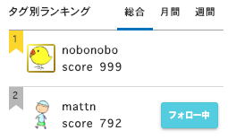

# おまえ誰よ？

- メカトロソフトエンジニア
- Pythonista & Gopher
- なんでも Go で書いちゃうひと
- Go 歴は８年目に突入
- サイト: <http://golang.rdy.jp/>
- 会社: 144Lab
- HN: nobonobo

====

# teratail がんばりました

- 最近 teratail の Go タグ部門 1 位になって
- 「999 ポイント」を獲得しました！
- あと 1 ポイントで Gold になります。



====

# アドベントカレンダー がんばりました

- Go アドベントカレンダー 2019 で はてブのホッテントリ入り。


====

# 今日お伝えしたいこと

- 初心者のハマりどころを熟知している僕が
- Gopher を目指す皆さんにお伝えしたいのは

====

# たったこれだけ。

<div class="fragment">
<h2>「Go に入れば Go に従う」</h2>

<ul>
<li>自己流で七転八倒するのでなく</li>
<li>コアメンバーの書き方を真似ていきましょう</li>
</ul>
</div>

====

# Gopher ですか？

- まだ Gopher ではないという方いらっしゃいますか？
- そんなあなたも今日は Gopher になれる方法を持ってきました
- 是非 Gopher になって帰ってください

====

# Gopher になるには

<a href="https://nobonobo.github.io/presantations/MakingToy/#7">

</a>
<p>
<b class="fragment">G キーを押すのです！</b>
</p>

====

# なれましたか？

====

# しくみ

====

# ざっくり

- tensorflowjs の posenet の検出結果を取得(JS)
- Gopher を描画する(Go)
- 三次元座標に変換して適用(Go)

====

# posenet


====

# 検出結果の詳細

- 17 箇所の特徴点が得られます
- このうち目と鼻の位置を利用

```jsonc
{
  "score": 0.32371445304906,
  "keypoints": [{...},{...},...{...}]
}
```

====

# 検出結果を Go 側に渡す

- window.postMessage で検出結果を送信
- window.onmessage で受け取り

====

# Gopher を描画する(Go)

- threejs を Go から利用
- canvas を WebGL 用にセットアップ（背景透過）
- カプセルと球のジオメトリで Gopher を組み立てる

https://github.com/nobonobo/presantations/blob/master/MakingToy/gopher.go

上記の「NewGopher 関数」を参考にしてください。

====

# 三次元座標に変換して Gopher の座標に適用

```go
  nose := pose.Index(0).Get("position") // nose
  leye := pose.Index(1).Get("position") // leftEye
  reye := pose.Index(2).Get("position") // rightEye
  sum := ( nose.Get("y").Float()/600-0.5 +
    leye.Get("y").Float()/600-0.5 +
    reye.Get("y").Float()/600-0.5 )
  center := nose.Get("x").Float()/600.0-0.5
  gopher.Get("position").Call("set", center, -sum/3, 0.0)
```

====

# 本当はこれをつくりたい


====

# まとめ

- このプレゼンツール自体 Go 製
- Go でもフロントエンド作れる
- ツラミもあります
- 初心者ネタも深いネタも懇親会で聞いて！

====

# 宣伝

144Lab では様々な IoT 案件に取り組んでいます

- BLE
- LoRa
- LTE-M

これらのモジュールも順次スイッチサイエンスで販売していきます！

====

# 滋賀で実験


====

<div style="position: relative; height: 70vh;">
<h1 style="position:absolute; top: 50%; left: 50%; transform : translate(-50%,-50%);">おわり</h1>
</div>
