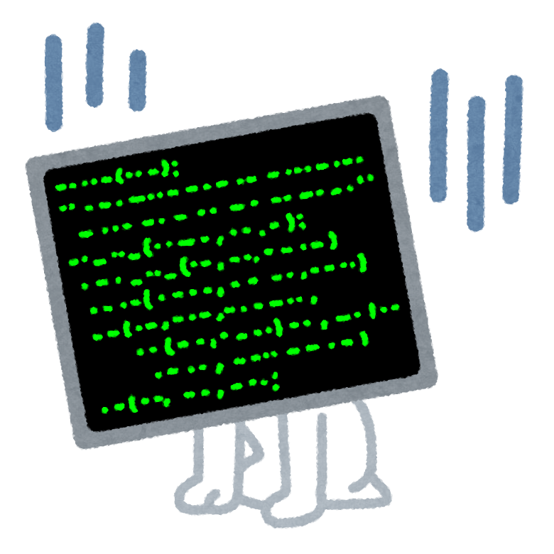
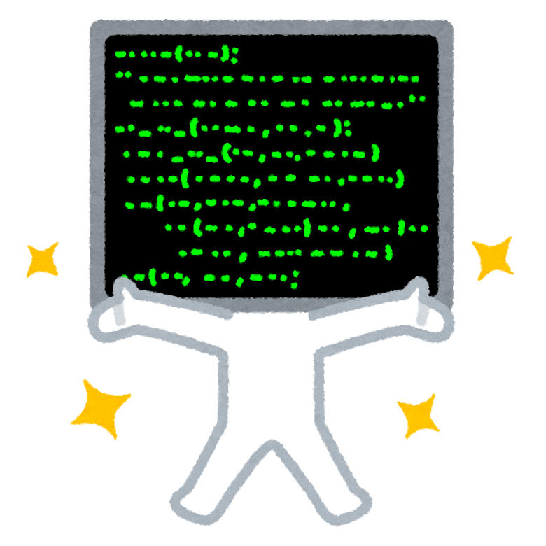

<div style="position: relative; height: 70vh;">
<h1 style="position:absolute; top: 50%; left: 50%; transform : translate(-50%,-50%);">（続）Goだけで作る<br/>フロントエンド</h1>
</div>

====

# おまえ誰よ？

- メカトロソフトエンジニア
- Pythonista & Gopher
- なんでも Go で書いちゃうひと
- Go歴は 7年目 に突入
- サイト: <http://golang.rdy.jp/>
- 会社: 144Lab
- HN: nobonobo

====

# JavaScriptの闇

<ul>
<li class="fragment">深い深い依存ツリーの上に作られた強力な開発支援ツール群</li>
<li class="fragment">そのうち歴史の浅いパッケージが半年後にうごくとは限らない</li>
<li class="fragment">入門記事の通りに構築できない開発環境</li>
<li class="fragment">時折壊れるフォーマッタやリンター</li>
<li class="fragment">スタックの奥底から投げられるアンドキュメント例外</li>
<li class="fragment">非同期例外ハンドラを仕掛けられないライブラリにPR</li>
<li class="fragment">多様なモジュールを取り込むためのモジュールの利用</li>
<li class="fragment">いつも誰かが新しいベストプラクティスを確立してる</li>
<li class="fragment">実質reactかvueかの２択に収束かと思いきや</li>
<li class="fragment">今年はESM+WebComponentsでベストプラクティスが生まれそう</li>
</ul>


====

# フロントの未来

<ul>
<li class="fragment"><strong>native-JavaScript</strong>と</li>
<li class="fragment"><strong>ES6-Module</strong>と</li>
<li class="fragment"><strong>WebComponents</strong>だけで書くようになる</li>
<li class="fragment">トランスパイラもバンドラーも不要になる？</li>
<li class="fragment">依存も目で追いやすいフラットな階層にとどまるように</li>
<li class="fragment">いろんなモジュールが細分化され</li>
<li class="fragment">読み込まれるモジュールはキャッシュが効くように</li>
<li class="fragment">ユーザーもロードが早くなり快適に</li>
</ul>



====

# JavaScriptを不要にする勢力

<ul>
<li class="fragment">TypeScript/Dart</li>
<li class="fragment">Elm/GopherJS/Scala.js/Haxe/...</li>
<li class="fragment">emscripten/rust</li>
<li class="fragment">AssemblyScript</li>
<li class="fragment"><strong>Go <- New!!</strong></li>
<li class="fragment"><strong>TinyGo <- New!!</strong></li>
</ul>

<p class="fragment">
TypeScript、DartやWebAssembly勢の成長が著しい。
</p>
<p class="fragment">
しかし、WebAssemblyはJSのコンテキストやDOMを直接触れられないのでJSと無縁でいることは出来ない。
</p>

====

# しかし、

<h4 class="fragment">JavaScriptを書きたくないでござる！</h4>
<h3 class="fragment">JavaScriptを書きたくないでござる！</h3>
<h2 class="fragment">JavaScriptを書きたくないでござる！</h2>
<h1 class="fragment"><strong>絶対に</strong>JavaScriptを書きたくないでござる！</h1>


====

# という人のためのAgenda

<ul class="fragment">
<li>ブラウザAPIの定義をGoでラップする</li>
<li>three.jsの定義をGoでラップする</li>
<li>VectyとWASMとgRPC-Web</li>
</ul>

<p class="fragment">
以上３本立てでお送りいたします。
</p>

====

# ブラウザAPIの定義をGoでラップする

<div class="fragment">
<h3>めっさ気合い入れて頑張ってる人がいた！</h3>
<h2>
https://github.com/gowebapi/webapi
</h2>
</div>
<h3>
<span class="fragment">Web-IDL</span>
<span class="fragment">--transpile-></span>
<span class="fragment">Goコード</span>
</h3>
<h3 class="fragment">このモジュール使うとwhatwg標準APIが全て呼べる！</h3>

====

# gowebapiサンプル

```go
package main

import (
  "github.com/gowebapi/webapi"
  "github.com/gowebapi/webapi/html"
  "github.com/gowebapi/webapi/dom/domcore"
)

func main() {
  element := webapi.GetWindow().Document().GetElementById("foo")
  button := html.HTMLButtonElementFromJS(element)
  button.SetInnerText("Press me!")
  count := 1
  callback := domcore.EventHandlerToJS(
    func(event *domcore.Event) interface{} {
      button.SetInnerText(fmt.Sprint("Count: ", count))
      count++
      return nil
    },
  )
  button.SetOnclick(callback)
  select{} // Wasmインスタンスが消えないおまじない
}
```

====

# wasmserveを使おう！

<ul>
<li class="fragment">@hajimehoshi 作</li>
<li class="fragment">https://github.com/hajimehoshi/wasmserve</li>
<li class="fragment">
Goのモジュールフォルダをカレントに<br/>
起動しておくだけでWASMビルドや<br/>
依存ファイルのサーブを<br/>
自動的にやってくれる。
</li>
<li class="fragment">
つまり、goのコードとwasmserveだけでフロントエンドが動く。
</li>
</ul>

====

# gowebapiのカバー範囲

<ul>
<li class="fragment">dom handling</li>
<li class="fragment">general events handling</li>
<li class="fragment">device sensor/usb/battery/gamepad</li>
<li class="fragment">touch events handling</li>
<li class="fragment">fullscreen api</li>
<li class="fragment">webgl/webgl2/webvr/webxr api</li>
<li class="fragment">webaudio api</li>
<li class="fragment">fetch/file api</li>
<li class="fragment">etc...</li>
</ul>

<p class="fragment"><strong>先日コントリビュートしてGopherJSでも動作するようになりました</strong></p>

====

# fetchを書いてみる

```go
webapi.GetWindow().Fetch(
  webapi.UnionFromJS(js.ValueOf("/wasm_exec.js")), nil,
).Then(
  fetch.PromiseResponseOnFulfilledToJS(
    func(r *fetch.Response) {
      log.Println(r.StatusText(), r.Body())
    },
  ),
  fetch.PromiseResponseOnRejectedToJS(
    func(err js.Value) {
      log.Println("error:", err)
    },
  ),
)
```

<p class="fragment"><strong>引数は若干冗長な変換が必須になってる</strong></p>

====

# three.jsの定義をGoでラップする

<h1 class="fragment"><strong>デモ</strong></h1>
<h3 class="fragment">ソース: https://github.com/nobonobo/three</h3>

====

# 定義を取り込む仕組み

<ul class="fragment">
<li>three.jsにはTS用Typings型アノテーションが付属</li>
<li>typedocツールでこれを解析してjsonを出力</li>
<li>jsonをパースしてラッパー用Goコードを生成</li>
</ul>

<h3 class="fragment">気楽に始めてみたものの・・・</h3>

====

# 直面した問題

<small>
<ul class="fragment">
<li>シンボルはTitleCaseに変換</li>
<li>「new Hoge()」は「NewHoge()」に変換</li>
<li>number型にintかfloat64のどちらを当てるのか -> 半手動</li>
<li>プロパティをどうする？ -> ゲッターセッターにする</li>
<li>メソッド名が上記とかぶったら？ -> 連番付与</li>
<li>Unionタイプをどう扱う？</li>
  <ul>
  <li>一部はjs.Wrapperタイプ扱いにする(手動指定)</li>
  <li>それ以外のUnionは最初の型のみサポート</li>
  </ul>
<li>継承タイプはどうする？ -> 半手動で記述</li>
<li>それでも難しいものはブラックリストに入れて除外</li>
<li>etc...</li>
</ul>
</small>

====

# このやり方の結論

<ul class="fragment">
<li>ヤックシェービングが延々と続く</li>
<li>特に配列周りはミスマッチが大きい</li>
<li>ツライ</li>
<li>そもそもthree.js依存そのものから逃れたい</li>
<li class="fragment">gowebapiに乗っかりたい</li>
</ul>

====

# VectyとWASMとgRPC-Web

<h1 class="fragment"><strong>デモ</strong></h1>
<h3 class="fragment">ソース: https://github.com/nobonobo/grpcweb-sample</h3>

====

# お気に入りのSpectre.CSSについて

<div class="fragment">

- CSSのみのフレームワーク
- bootstrap並のフルフィーチャー
- jsによる処理を必要としないので動的DOM生成と相性が良い
- ユーティリティやモダンなコンポーネントも概ね揃ってる
- 簡素な特徴にとどめてあってスタイルカスタマイズがしやすい
- レスポンシブ対応あり
- 最小限のアイコン用フォントリソースも提供
- ３つのCSSを参照するだけで使い始められる
- ヘディングやリストはクラスなしでもデフォルトスタイルが適用
- 指定するクラス名はプレフィックスもなくより簡素

</div>

====

# VectyからSpectre.cssつかう方法

```go
vecty.AddStylesheet("https://unpkg.com/spectre.css/dist/spectre.min.css")
vecty.AddStylesheet("https://unpkg.com/spectre.css/dist/spectre-exp.min.css")
vecty.AddStylesheet(
  "https://unpkg.com/spectre.css/dist/spectre-icons.min.css")
```

<h1 class="fragment"><strong>たった3行！</strong></h1>

====

# gRPC-Webについて

<div class="fragment">

- gRPCをWebプロトコルから利用可能にしようという仕様
- HTTP-APIまたはWebsocket経由で使えるようにする
- 双方向ストリーミングサポートを得るにはWebsocketが必要
- IDLを記述することでサービス内容のI/Fを厳格に定義できる
- IDLからドキュメント生成すれば正確なドキュメントを維持できる
- http2サーバーが必須（Goなら証明書さえあれば簡単）

</div>

====

# go.modに以下の記述が必要

```config
replace google.golang.org/grpc => 
  github.com/johanbrandhorst/grpc-go add-grpc-web-client
```

proto/web.protoファイル

```proto
syntax = "proto3";
package web;
option go_package = "web";
service Backend {
    rpc GetUser(GetUserRequest) returns (User) {}
    rpc GetUsers(GetUsersRequest) returns (stream User) {}
}
message GetUserRequest {
    string user_id = 1;
}
message User {
    string id = 1;
}
message GetUsersRequest {
    int64 num_users = 1;
}
```

====

# スタブ生成

```shell
> go get github.com/golang/protobuf/protoc-gen-go
> cd proto
> protoc -I. ./web.proto --go_out=plugins=grpc:.
```

出力される`web.pb.go`はサーバーからもクライアントからも参照する

====

# 開発サーバー実装(1)

backendモジュールにてBackend構造体に必要なメソッドを定義する。

main.goではgrpcwebのWrapServerにBackendインスタンスを載せる

```go
gs := grpc.NewServer()
web.RegisterBackendServer(gs, &backend.Backend{})
wrappedServer := grpcweb.WrapServer(gs)  
```

====

# 開発サーバー実装(2)

1. さっきのwrappedServerに行くHTTPリクエストの条件で振り分け、
2. wrappedServerに向かうリクエストはそのままハンドル。
3. そうでないリクエストはwasmserveへリバースプロキシで転送する。<br/>
   （Goはホント簡単にリバースプロキシが作れるなぁ）

```go
rev := httputil.NewSingleHostReverseProxy(&url.URL{
  Scheme: "http", Host:   "localhost:8080",
})
http.HandleFunc("/", func(w http.ResponseWriter, r *http.Request) {
  if r.ProtoMajor == 2 && strings.Contains(
    r.Header.Get("Content-Type"), "application/grpc",
  ) {
    wrappedServer.ServeHTTP(w, r)
    return
  }
  rev.ServeHTTP(w, r)
})
```

====

# クライアント側の実装

```go
cc, err := grpc.Dial("")
if err != nil {
  log.Println(err)
  return
}
client := web.NewBackendClient(cc)
resp, err := client.GetUser(context.Background(), &web.GetUserRequest{
  UserId: "1234",
})
```

====

# gRPC-Web実装まとめ

<ul class="fragment">
<li>最初の取っ付きはややこし目</li>
<li>あとのメンテは定形処理でOK</li>
<li>だいぶ複雑なものもガンガン作れる</li>
<li>HTTP2をクラウドで確保はまだちょっと面倒</li>
<li class="fragment">成果物WASMサイズが20MB超えた・・・</li>
<li class="fragment">これだとネットワーク環境が良好でないと使いにくい</li>
</ul>

====

# いろいろやってみて見えてきたこと

<ul class="fragment">
<li>Go+WASMはほぼ動かすのに困らなくなってきた</li>
<li>VectyもWASM対応＆1.0マイルストーン公開</li>
<li>Web-IDLやTS-TypingsからGoのラッパーが作れること</li>
<li>gRPCだとAPIドキュメントの維持が正確で良い</li>
<li class="fragment">TinyGoがVectyサポートしようとしてる</li>
<li class="fragment">TinyGoが吐くWASMサイズはGoの20%程度</li>
<li class="fragment">GoのgRPC-Webはプロダクションレディ（と作者が発言）</li>
<li class="fragment"><strong>実はこのスライドショーGo＆Vectyで自作</strong></li>
<li class="fragment">ソース: http://github.com/nobonobo</li>
</ul>

====

# vuguはどうなの？

<ul class="fragment">
<li>単独でdevサーブできる</li>
<li>静的ファイル群デプロイできる機能が素晴らしい</li>
<li>シングルファイルコンポーネントも素晴らしい</li>
<li class="fragment">が、欠点もある</li>
<li class="fragment">エディタのコードハイライトや補完が効かない</li>
<li class="fragment">そろそろvugufmtがエディタプラグインに</li>
<li class="fragment">URLルーターが欲しいところだけど未実装</li>
<li class="fragment">マウントタイミングのフックが望まれつつまだ未実装</li>
</ul>

<h1 class="fragment"><strong>それぞれ実装の予定があるのでもうしばし待つべし</strong></h1>

====

# Go+WASMの未来

<ul>
<li class="fragment">去年作ったVectyコンポーネント動くよ</li>
<li class="fragment">TinyGo対応来たらNative-JSより有利</li>
<li class="fragment">（JSは使わないコードの除去が弱いので）</li>
<li class="fragment">TinyGoの<a href="https://justinclift.github.io/tinygo-wasm-rotating-cube/">WebGLデモ</a>のWASMサイズが12キロバイト以下</li>
<li class="fragment">Vectyでダッシュボード量産できてる</li>
</ul>

<h2 class="fragment">けっこう明るいし有望なんじゃないでしょうか？</h2>

====

<div style="position: relative; height: 70vh;">
<h1 style="position:absolute; top: 50%; left: 50%; transform : translate(-50%,-50%);">質問？</h1>
</div>

====

<div style="position: relative; height: 70vh;">
<h1 style="position:absolute; top: 50%; left: 50%; transform : translate(-50%,-50%);">おわり</h1>
</div>
