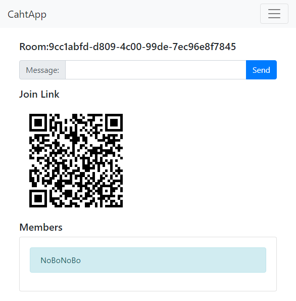
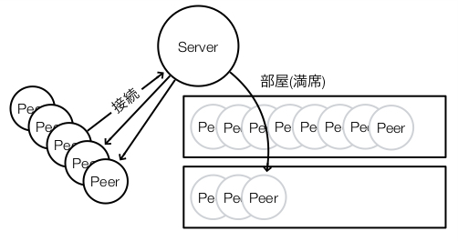
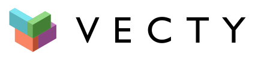

<!-- .slide: class="center" -->

# Go だけで 〇〇〇〇を作ってみた

====

<!-- .slide: data-background-image="./assets/media/icon.png" data-background-size="85vh" -->

# お前誰よ？

- メカトロソフト屋
- Pythonista -> Gopher
- なんでも Go で書いちゃうひと
- Go 歴は５年経過くらい
- サイト: http://golang.rdy.jp/
- 会社: 144Lab(2017/07/01 から新社名)
- HN: @nobonobo

====

# 昨今の AltJS 事情

---

# 高級言語の AltJS

- 100%変換できない
- 高級言語の資産が使えない
- 書き手のストレス->マッハ
- ことごとくネタで終了

---

# JS ヘビーユーザー談

- ES5 に変換はまだ必要
- しかし、ES5 の習わしは忘れろ
- no jQuery, use Promise
- ESM で書いて一つのファイルにパックが現実解
- AltJS なら **TypeScript** が有望

---

# JS のツラミ

- モジュール機構の分断
- 非同期の書き方の変革期
- ES バージョン分断
- 型がない/型導入手段による分断
- エコシステムの分断
- 古い・新しい記述と付き合い続ける
- ゆるいエラーハンドリング

---

# TypeScript なら？

- 最新の JS 記述＋型システムで書ける
- 静的型言語の恩恵が得られる
- 成果物のモジュールや ES バージョンも設定で選べる
- JS の資産も TS の資産も使える
- ソースマップで TS ソースでデバッグ

---

# そこで GopherJS

- Go の記述を 100%変換できる
- Go のモジュール機構を利用
- 1 ファイルにパック出力
- js,go,GopherJS の資産がすべて使える
- 静的型言語の恩恵が得られる
- ソースマップで Go ソースでデバッグ
- 非同期の書き方は Go ウェイが確立済み
- Go の記述は 8〜10 年単位で安定してる
- 強固なエラーハンドリング文化

TypeScript より有望？

---

# GopherJS+Vecty

- Go と Go の周辺ツールだけで
- フロントエンドが構築可能
- (ただし CSS は別)
- 1Password-X での採用事例アリ
- bootstrap4 コンポーネントつくったし
- HTML から Vecty 用記述を生成ツールもつくったし
- wasm 対応も進行中

**超有望だと思ってる**

====

<!-- .slide: class="center" -->

# これまでの登壇ネタ

====

<!-- .slide: class="center" -->

# Go モバイルでピアノ App

<video style="height: 70%">
    <source data-src="http://golang.rdy.jp/gomobile-piano/images/piano-bug.mov" type="video/mp4" />
</video>

====

<!-- .slide: class="center" -->

# GopherJS の紹介

====

<!-- .slide: class="center" -->

# WebRTC で P2P

====

<!-- .slide: class="center" -->

# 仮想ラジコンカー

<video style="height: 70%">
    <source data-src="http://golang.rdy.jp/DevKansai2016/media/rccargo.mp4" type="video/mp4" />
</video>

====

<!-- .slide: class="center" -->

# Go で GUI をつくる

====

<!-- .slide: class="center" -->

# Go だけで作るフロントエンド

====

<!-- .slide: class="center" -->

# これらの登壇資料は？

**GopherJS で作られておりますー**

====

<!-- .slide: class="center" -->

# 集大成として・・・

====

<!-- .slide: class="center" -->

# Go だけで TPS を作りました

---

<!-- .slide: class="center" -->

# と言いたかったんですが・・・

---

<!-- .slide: class="center" -->

# Go だけでロビーサーバーを作りました

になっちゃいました・・・(´・ω・｀)

====

<!-- .slide: class="center" -->

#### 作るのに必死すぎて資料がしょぼいのはご容赦ください・・・

====

# 構成

- ロビーサーバー
- P2P メッシュネットワーク
- Web-UI フロントエンド
- 3D レンダリング

====

# ロビーサーバー

- WebRTC 用シグナリングを兼ねる
- Websockets ベース
- 同時最大 10K 接続、1K ルームを想定
- **マッチング後 P2P へ移行してルームは消滅する**
- 「待ち：プレイ＝ 1:9」なら 100K ユーザーがさばける
- プレイ人口を増やすだけなら複数サーバーでスケール

現状サーバーをまたいだマッチングができないが、 外部 PUB-SUB があればできるようになる

====

# P2P メッシュネットワーク

- ピアは**GopherJS**で構築
- WebRTC の RTCDataChannel 利用
- ピア間を相互に接続する
- ８ユーザーなら各７接続 × ８で５６接続
- 通信は P2P のため低遅延
- 遅延対策を頑張らないでもそこそこ OK

====

# WebRTC と DataChannel

- こまけぇこたぁググって！
- この春やっと iOS-Safari でも OK になった
- ぶっちゃけセッション確立超めんどい
- Peer1 と Peer2 を pub-sub サーバー使ってつなぐのに
- 主導権が交互に巡るように仕込むのがめんどい

---

# そこで逆転の発想

### 接続のきっかけは Peer から Server だけど、 制御は Server から Peer にする。

## **主従逆転**の発想<!-- .element: class="fragment" -->

---

# Peer-Server-Room

<!-- .element: style="height:50%" -->

---

# そうすると

1. Peer1 は**RPC サーバーをサーブ**
2. Peer2 は**RPC サーバーをサーブ**
3. Server は Peer1 で createOffer を実行
4. Server は Peer2 で createAnswer を実行
5. Server は Peer1 に Answer を渡す

RPC と主従逆転で主導権を渡すことなく 
**シーケンシャルに P2P セッションを確立できる**

<!-- .element: class="fragment" -->

---

# 結果

- ロビーとメッシュ確立まで 1000 行程度
- Isomophic だからこそ rpc がそのまま繋がる
- 各 Peer 間をメッシュでつなぐのも
- Server 側でループを組むだけで OK
- 正常に確立できたらあとは P2P で
- Server は WebSockets を切断する

====

# Web-UI フロントエンド

- GopherJS 用フロントエンドライブラリ
- react ライク
- Go 記述で HTML/JS/スタイルを表現
- wasm 対応も始まってる

====

<!-- .slide: data-background-image="assets/media/threejs.png" data-background-size="85vh" -->

# 3D レンダリング

## **three.js**

- GopherJS は js 資産が使えるが、
- 渡すべき値に不備があっても
- 無視して期待通りにならない
- という動的言語の定めをも引き込んでしまう

## 本当はここも Go にしたい<!-- .element: class="fragment" -->

====

<!-- .slide: class="center" -->

動くようになってるかどうかわからないが

# 動作デモ

## https://gophertank.irieda.com<!-- .element: class="fragment" -->

====

# 競合のマッチング（ロビー）サーバー

Go 実装によるロビーサーバーの競合

- https://github.com/heroiclabs/nakama
- https://github.com/GoogleCloudPlatform/open-match

これらには P2P コネクション機能はない 
ユーザー数に比例してサーバーリソースをガンガン使っちゃう 
（Google は商売的にそれが正しい）​ 
これらも低レイテンシをうたってはいるけど P2P が最強だよね。

====

<!-- .slide: class="center" -->

# まとめ

- #### GopherJS 超有望
- #### Vecty 超有能
- #### Isomorphic はいいぞ
- #### wasm への幕開けはすぐそこだ
- #### RTC セッションには RPC と主従逆転が有効
- #### Go に WebGL サポートライブラリが欲しい
- #### P2P は低遅延性能が最強

---

<!-- .slide: class="center" -->

- GopherJS の唯一の弱点は公式じゃなかったところ
- wasm 対応版が公式に取り込まれた
- なので今後は大手を振って使える
- wasm も webrtc ももはやすべてのメジャー環境で動く

====

<!-- .slide: class="center" -->

# おわり
