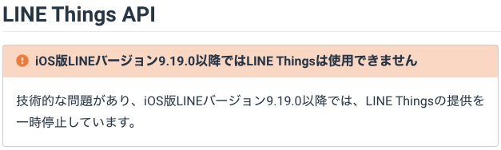

<h1 style="position:absolute; top: 50%; left: 50%; transform : translate(-50%,-50%);">LINE-Things で やらかした話</h1>

====

# おまえ誰よ？

- メカトロソフトエンジニア
- Pythonista & Gopher
- なんでも Go で書いちゃうひと
- Go 歴は８年目に突入
- サイト: <http://golang.rdy.jp/>
- 会社: 144Lab, Inc.(スイッチサイエンスの兄弟)
- HN: nobonobo

====

# IoT デバイスの実験

- BLE センサーデータをクラウドに
- LINE-Things いいじゃん！

====

# LINE-Things の仕組み

====

# LINE-Things の制約？

- Webhook に関する制限が明文なし

> LINE では、健全なアカウント運用を推進するため、一定数を超えて Webhook を利用した channel に対して、強制的にその利用を停止することがあります。

====

# (参考情報)

- Messaging-API の一般ボットの制約
- 10,000 リクエスト/分
- 170 リクエスト/秒

====

# 実験開始

条件

- １分あたり 100 件程度
- 自動送信シナリオ利用
- 自前 Webhook サーバー

====

# 順調に動いていた

- 数日快調に動く

<h3 class="fragment">ある日突然デバイスがリンクできなくなった</h3>
<h3 class="fragment">(　ﾟдﾟ)</h3>
<h3 class="fragment">nannde?</h3>

====

# 理由

====

# 泣く泣く Android で再セットアップ

- 数日快調に動く

<h3 class="fragment">ある日突然デバイスがリンクできなくなった</h3>
<h3 class="fragment">(　ﾟдﾟ)</h3>
<h3 class="fragment">nannde?</h3>

====

# いろいろ再設定

- シナリオの再設定
- プロダクトの再登録
- チャンネルの再登録
- プロバイダの再登録

====

====

# たすけてー

- デベロッパーサイトの問合せフォーム
- コミュニティサポートのリンク

====

# たすけてー

- facebook

====

# たすけてー

- Discord
- がおまるさんのサポート
- やり方自体に問題がないのがはっきり

====

# 同僚に別垢で試してもらった

<h2 class="fragment">Webhookがキター！</h2>

====

# というわけで

## 僕のアカウントは・・・

<h2 class="fragment">凍結されました</h2>

====

# その後

- 会社のスマホを調達
- 別垢セットアップ
- LINE-Things の再セットアップ

<h3 class="fragment">ようやくWebhookが無事飛んでくるようになりましたー。</h3>

====

<h2 class="fragment">めでたし、めでたし。</h2>

====

# その後

- サーバーログを調査

<h2 class="fragment">２時間９０万件ログ</h2>
<h2 class="fragment"> (　ﾟ д ﾟ)?</h2>

====

# ログに重複

- 凍結時の一時的な挙動？

====

<h1 style="position:absolute; top: 50%; left: 50%; transform : translate(-50%,-50%);">おわり</h1>

