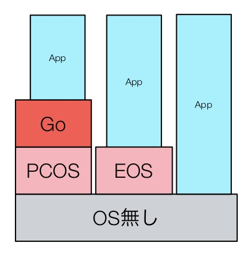
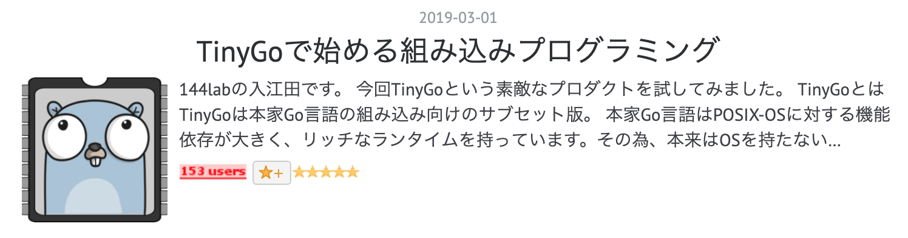

<!-- .slide: class="center" -->

# TinyGoでIoTを始めよう

====

<!-- .slide: data-background-image="./assets/media/icon.png" data-background-size="85vh" data-background-opacity="0.3" -->

# お前誰よ？

- メカトロソフト屋
- Pythonista -> Gopher
- 趣味でGoに向かない分野の開拓
- Go歴は６年弱くらい
- サイト: <http://golang.rdy.jp/>
- 会社: 144Lab(2017/07/01 から新社名)
- HN: @nobonobo

====

# 組み込み開発って？

<!-- .element: class="fragment" -->

====

# 組み込みと言っても？

大別して

- PC向けOSの上で組み込み
- PC向けOS無しで組み込み<br>
  （組み込み向けOSまたはOS無し）

という２種類があります。

====

# PC向けOSの上で組み込み

- PCに近い小型ボード（RaspberryPiなど）で<!-- .element: class="fragment" -->
- LinuxやWindows10の上に<!-- .element: class="fragment" -->
- アプリを実装するスタイル<!-- .element: class="fragment" --><li class="fragment"><https://gobot.io>が素晴らしい</li>
- ただし、電源確保が必須<!-- .element: class="fragment" -->
- モノの選択肢は実質２択<!-- .element: class="fragment" -->
  - RaspberryPi系
  - 高価なボードの類

Note:
これは従来からGoの得意分野です。
Goのツールひとつで様々なCPUとOS向けの実行バイナリを出力できます。
このスタイルであればGoの旨味を存分に発揮して
ガンガン実装できます。
I/O周りのドライバの類も探せば何かしら見つかります。

====

# PC向けOS無しで組み込み

- Goの不得意分野<!-- .element: class="fragment" -->
- Goの裏方の機能セットがOSに依存<!-- .element: class="fragment" -->
- goroutineのスケジューラやGCなど<!-- .element: class="fragment" -->
- OSの無い環境に移植するコストが高い<!-- .element: class="fragment" -->
- 低レイヤのI/O支援機能がもともと無い<!-- .element: class="fragment" -->
- PCと違い物理的に多様すぎる環境<!-- .element: class="fragment" -->

Note:
なので、Goは組み込みが得意でもあり不得意でもあるのです。
語り手の「組み込み」がどちらのスタイルを指しているのかは注意して区別しましょう。

====

# 組み込み開発の世界

- ソフトウェアの知識が求められる<!-- .element: class="fragment" -->
- 低レイヤーの知識も求められる<!-- .element: class="fragment" -->
- ハードウェアの知識も少し求められる<!-- .element: class="fragment" -->
- 開発環境を整えるのにコストがかかる<!-- .element: class="fragment" -->

### **組み込み is Hard!**<!-- .element: class="fragment" -->

====

# そして・・・

- C/C++がデファクトスタンダード<!-- .element: class="fragment" -->
- CだけならまだしもC++はツライ<!-- .element: class="fragment" -->
- 処理の実体を隠すのが上手すぎる<!-- .element: class="fragment" -->
- 困難な依存解決<!-- .element: class="fragment" -->
- include地獄とIFDEF地獄<!-- .element: class="fragment" -->
- オーバーロードにテンプレート<!-- .element: class="fragment" -->

### **組み込み is Hard!**<!-- .element: class="fragment" -->

====

## C/C++の代わりにGoなら？

- リーダビリティ最高！<!-- .element: class="fragment" -->
- エラーを徹底してチェックする文化！<!-- .element: class="fragment" -->
- undefined-behavierに悩まされない！<!-- .element: class="fragment" -->
- 依存解決にgo-getが使える！<!-- .element: class="fragment" -->

#### **組み込みが少し身近になるかも？！**<!-- .element: class="fragment" -->

====

<!-- .slide: class="center" -->

# というわけで

# **TinyGoですよ！！**<!-- .element: class="fragment" -->

====

# 先月ホッテントリ入り


<https://tech.144lab.com/entry/tinygo>

Note:
基本はこちらを読んでもらうとして・・・

====

# ターゲット例

====

<!-- .slide: data-background-image="./assets/media/IMG_5902.jpg" data-background-size="85vh" data-background-opacity="0.3" -->

# micro:bit

- 対応開発ツールの数がトップクラス
- ブロック方式で小学生もプログラミングOK
- ブロックに飽きたらJS,TSへ
- ArduinoでもPythonでもRuby,Jacvascript,Luaなどなど
- プロ向け`SEGGER Embedded Studio`でもOK

====

<!-- .slide: data-background-image="./assets/media/IMG_5903.jpg" data-background-size="85vh" data-background-opacity="0.3" -->

# circuit playground express

- 搭載ギミック数がトップクラス
- フルカラー階調つきLED１０個
- スピーカーにマイク
- 光量センサ、温度・湿度センサ
- ６軸（加速度・角速度）センサ
- IRリモコン送受信
- タッチセンシング
- UART/USB/SPI/I2C/etc...

====

<!-- .slide: class="center" -->

# 実際にいろんなコードを

# コンパイルしてこれらで

# 動かしてみましょう！

====

# TinyGoの使い方

```shell
$ docker run -it --rm tinygo/tinygo tinygo version
tinygo version 0.4.1 linux/amd64
```

dockerベースが今はオススメです。

（devブランチビルドは大変 ＆ 高頻度で依存は変更される）

- - -

#### たまにアップデートしてみましょう

```shell
$ docker pull tinygo/tinygo:latest
latest: Pulling from tinygo/tinygo
Digest: sha256:821ad71e7d9b3fe46a84a5818e52d3d3596e0d8f3855f8407b917a37371b2b23
Status: Image is up to date for tinygo/tinygo:latest
```

====

### sample１

```go
package main

import (
	"machine"
	"time"
)

func main() {
	led := machine.GPIO{machine.LED}
	led.Configure(machine.GPIOConfig{Mode: machine.GPIO_OUTPUT})
	for {
		led.Low()
		time.Sleep(time.Millisecond * 500)

		led.High()
		time.Sleep(time.Millisecond * 500)
	}
}
```

いわゆるLチカ（組み込みでのHelloWorld）

====

## ビルド

```sh
$ go mod init github.com/nobonobo/examples/sample1
$ PACKAGE_PATH = github.com/nobonobo/examples/sample1
$ PROJECT_PATH = /go/src/$PACKAGE_PATH
$ docker run -it --rm $PWD:$PROJECT_PATH -w $PROJECT_PATH \
  tinygo/tinygo tinygo build -target=circuitplay-express -o output.uf2 .
```

`output.uf2` --Drag&Drop--> CIRCUITPYデバイス

##### **これだけでターゲットに書き込まれる**<!-- .element: class="fragment" -->

====

# TinyGoの提供バス実装(1)

共通で提供するバス

- GPIO(汎用入出力ピン)
- ADC（アナログ計測）
- PWM（サーボ、パワーコントロール向け）
- UART（PCとの連携用）
- SPI（小さなデバイスとの連携用）
- I2C（小さなデバイスとの連携用）

- - -

# TinyGoの提供バス実装(2)

一部のターゲット

- DAC（アナログ電圧発生）

====

### アーキテクチャ別の提供機能

- レジスタアクセス
- インラインアセンブラ
- タイマー、UARTハンドリング

ほとんどのターゲットで<br/>
「println」で<br/>
シリアルポートにデバッグログを出力できる。

====

## 周辺デバイス別ドライバー

##### <https://github.com/tinygo-org/drivers>

| Device Name                                                                                                         | Interface Type |
| ------------------------------------------------------------------------------------------------------------------- | -------------- |
| [APA102 RGB LED](https://cdn-shop.adafruit.com/product-files/2343/APA102C.pdf)                                      | SPI            |
| [BH1750 ambient light sensor](https://www.mouser.com/ds/2/348/bh1750fvi-e-186247.pdf)                               | I2C            |
| [BlinkM RGB LED](http://thingm.com/fileadmin/thingm/downloads/BlinkM_datasheet.pdf)                                 | I2C            |
| [BMP180 barometer](https://cdn-shop.adafruit.com/datasheets/BST-BMP180-DS000-09.pdf)                                | I2C            |
| ["Easystepper" stepper motor controller](https://en.wikipedia.org/wiki/Stepper_motor)                               | GPIO           |
| [ESP8266/ESP32 AT Command set for WiFi/TCP/UDP](https://github.com/espressif/esp32-at)                              | UART           |
| [MAG3110 magnetometer](https://www.nxp.com/docs/en/data-sheet/MAG3110.pdf)                                          | I2C            |
| [MMA8653 accelerometer](https://www.nxp.com/docs/en/data-sheet/MMA8653FC.pdf)                                       | I2C            |
| [MPU6050 accelerometer/gyroscope](https://store.invensense.com/datasheets/invensense/MPU-6050_DataSheet_V3%204.pdf) | I2C            |
| [WS2812 RGB LED](https://cdn-shop.adafruit.com/datasheets/WS2812.pdf)                                               | GPIO           |

<!-- .element: style="font-size: 50%" -->

====

## 外部パッケージとdocker

- 依存するパッケージを追加したい！！<!-- .element: class="fragment" -->
- あれ？dockerベースだとどうする？！<!-- .element: class="fragment" -->

#### そこで**go mod**ですよ

<!-- .element: class="fragment" -->

```shell
$ export GO111MODULE=on
$ go mod github.com/..../sample1
$ go get github.com/tinygo-org/drivers/ws2812
$ go mod vendor
```

<!-- .element: class="fragment" -->

====

## すると？

- vendor/
  - github.com/
    - tinygo-org/
      - drivers/
        - ws2812/
- main.go

さっき示したdockerコマンドでコンテナ内から<br/>
ws2812パッケージが参照可能になる。

<!-- .element: class="fragment" -->

====

### LEDストリップドライバを作る

```go
package main

import (
	"device/arm"
	"image/color"
	"machine"

	"github.com/tinygo-org/drivers/ws2812"
)

// NeopixelDriver represents a connection to a NeoPixel
type NeopixelDriver struct {
	pin        machine.GPIO
	device     ws2812.Device
	pixelCount int
	pixels     []color.RGBA
}

// NewNeopixelDriver returns a new NeopixelDriver
func NewNeopixelDriver(pin machine.GPIO, pixelCount int) *NeopixelDriver {
	pin.Configure(machine.GPIOConfig{Mode: machine.GPIO_OUTPUT})
	neo := &NeopixelDriver{
		pin:        pin,
		device:     ws2812.New(pin),
		pixelCount: pixelCount,
		pixels:     make([]color.RGBA, pixelCount),
	}

	return neo
}

// Pin returns the Driver's pin
func (neo *NeopixelDriver) Pin() machine.GPIO { return neo.pin }

// Show activates all the Neopixels in the strip
func (neo *NeopixelDriver) Show() {
	mask := arm.DisableInterrupts()
	defer arm.EnableInterrupts(mask)
	neo.device.WriteColors(neo.pixels)
}

// SetPixel sets the color of one specific Neopixel in the strip
func (neo *NeopixelDriver) SetPixel(pix int, color color.RGBA) {
	neo.pixels[pix] = color
}
```

====

## そして動かしてみる

```go
package main

import (
	"image/color"
	"machine"
	"time"
)

const NUM_PIXELS = 10

func main() {
	neo := NewNeopixelDriver(machine.GPIO{machine.NEOPIXELS}, NUM_PIXELS)
	n := 0
	var pows = []uint8{255, 127, 63, 31, 15, 7, 3, 1, 0, 0}
	for {
		for i := 0; i < NUM_PIXELS; i++ {
			pow := pows[NUM_PIXELS-1-i]
			neo.SetPixel((n+i)%NUM_PIXELS, color.RGBA{R: pow, G: pow, B: pow})
		}
		neo.Show()
		time.Sleep(100 * time.Millisecond)
		n = (n + 1) % NUM_PIXELS
	}
}
```

====

# DEMO

<h3 style="margin: auto; position: absolute; color: red" class="fragment">目がー・・目がー！！</h3>

<video height="80%" data-autoplay>
    <source src="./examples/sample2/output.mov" type="video/mp4" />
</video>

====

### 明るさに応じてLEDを灯す

```go
package main

import (
	"image/color"
	"machine"
	"time"
)

const NUM_PIXELS = 10

func main() {
	machine.InitADC()
	sensor := machine.ADC{machine.A8}
	sensor.Configure()
	neo := NewNeopixelDriver(machine.GPIO{machine.NEOPIXELS}, NUM_PIXELS)
	for {
		for i := 0; i < NUM_PIXELS; i++ {
			pow := uint8(sensor.Get() / 256)
			neo.SetPixel(i, color.RGBA{R: pow, G: pow, B: pow})
		}
		neo.Show()
		time.Sleep(100 * time.Millisecond)
	}
}
```

====

# DEMO

====

## Goっぽく書く

```go
package main

import (
	"image/color"
	"machine"
	"time"
)

const NUM_PIXELS = 10
```

- - -

### ボタン監視関数

```go
func observer(event chan int) {
	btnA := machine.GPIO{machine.BUTTONA}
	btnA.Configure(machine.GPIOConfig{Mode: machine.GPIO_INPUT_PULLDOWN})
	btnB := machine.GPIO{machine.BUTTONB}
	btnB.Configure(machine.GPIOConfig{Mode: machine.GPIO_INPUT_PULLDOWN})
	next := make([]bool, 2)
	prev := make([]bool, 2)
	prev[0], prev[1] = btnA.Get(), btnB.Get()
	for {
		time.Sleep(20 * time.Millisecond)
		next[0], next[1] = btnA.Get(), btnB.Get()
		for i := range next {
			if !prev[i] && next[i] {
				event <- i
			}
		}
		prev[0], prev[1] = next[0], next[1]
	}
}
```

- - -

#### レンダリング関数

```go
func renderer(ch chan *NeopixelDriver) {
	for {
		v := <-ch
		v.Show()
	}
}
```

- - -

#### main関数

```go
func main() {
	events := make(chan int)
	go observer(events) // ボタン監視タスク起動

　neo := NewNeopixelDriver(machine.GPIO{machine.NEOPIXELS}, NUM_PIXELS)
	ch := make(chan *NeopixelDriver)
	go renderer(ch) // レンダラータスク起動

	prev, next := 0, 0
	neo.SetPixel(prev, color.RGBA{R: 10, G: 10, B: 10})
	ch <- neo // レンダリングを発火

	for {
		select {
		case v := <-events:
			switch v {
			case 0:
				println("buttonA pressed")
				next++
				if next >= NUM_PIXELS {
					next = 0
				}
			case 1:
				println("buttonA pressed")
				next--
				if next < 0 {
					next = NUM_PIXELS - 1
				}
			default:
				continue
			}
		}
		neo.SetPixel(prev, color.RGBA{R: 0, G: 0, B: 0})
		neo.SetPixel(next, color.RGBA{R: 10, G: 10, B: 10})
		ch <- neo // レンダリングを発火
		prev = next
	}
}
```

====

# DEMO

====

# まとめ

- 並行処理が超書きやすい！
- 現状の低レイヤ拡張手段
  - インライアセンブラ
  - SVCall
- CGOサポートや高レベルサポートが不足
- TinyGoのビルドではgo-modはまだ使えない
- が、dockerとの併用でなんとかなる<!-- .element: class="fragment" -->

====

# 今後の発展

====

# 活発な活動

- BLEライブラリ対応
- CGOサポート
- 加速度センサなどのドライバー
- ESPシリーズのサポート

====

# 現状のネット機能

- 以下のアイテムを使うことで実現可能
- ESP8266 or ESP32 という格安Wi-Fi機能付きマイコン
- driversにある[ESP8266/ESP32 AT Command set for WiFi/TCP/UDP](https://github.com/espressif/esp32-at)
- 今回のターゲットをESPモジュールとUARTという２信号をつなぐ
- TCP/UDP通信が可能になる

====

# 今後のネット接続

- LINE Thingsのように今や誰もが持つスマホを
- BLEtoインターネットのハブにしちゃうアイディアも
- LoRa、NB-IoTモジュールもぼちぼち入手可能になりつつあります

====

# WebAssembly出力

- 本家よりも効率的な成果を出せる
- syscall/jsサポートなども始まってる

====

# IoT開発はどんどん身近になってきてますよ！

====

<!-- .slide: class="center" -->

# おわり
